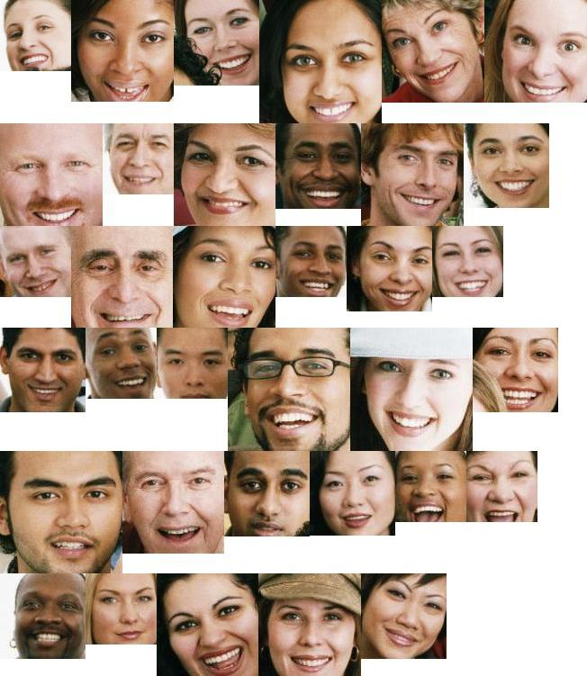

# WATTARY Eye:

**This part consists of 2 steps:**
- [x] Extracting faces from an image (Detecting).
- [ ] Recognize faces from a saved data.

**Dependencies:**
- dlib *[requires cmake >= 2.8.13]*.
- sci-kit learn *(skimage)*.

**Results:**
1. Feed the module with an image.


2. The returned images after merging:



3- The provement:


## Step 1: Detecting Faces:

**Note: A face must be more than 100px*100px to be detected.**

**To detect faces from any image use `faceDetector.py`, you can import it in your work by typing:**

```python
import Eye.faceDetector
```
or
```python
from Eye import faceDetector
```

The detector module contains a function called `detectFaces()` which takes a parameters [the path of the image] and it will return the detected faces.


